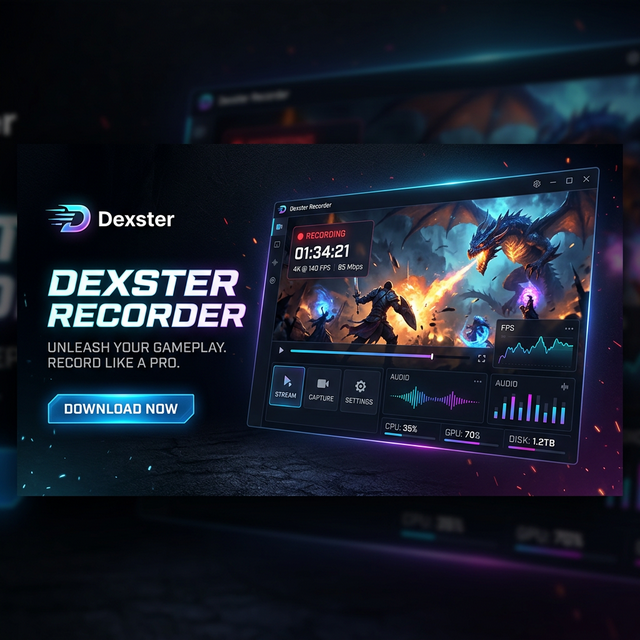
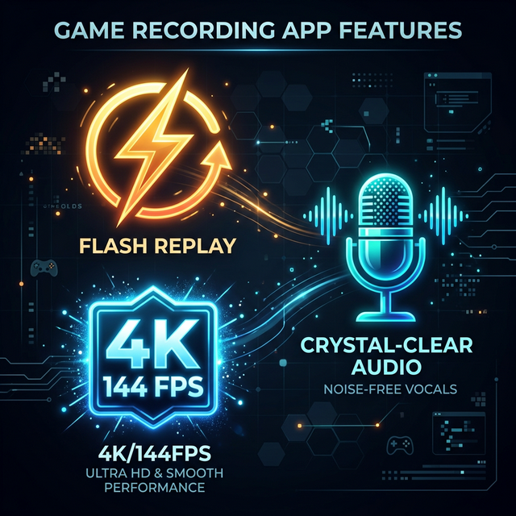

  

  # 🎮 Dexster Recorder
  **The Ultimate High-Performance Game Recording & Clipping Software**

  
  
  

 

## 🚀 لماذا تختار Dexster Recorder؟

تم تصميم **Dexster Recorder** خصيصاً للاعبين المحترفين وصناع المحتوى الذين يبحثون عن أقصى أداء دون التضحية بجودة الصورة. بفضل محرك التسجيل المطور، يمكنك التقاط أفضل لحظاتك بدقة فائقة وبدون أي تقطيع.

  

---

## 🔥 الميزات الخرافية (Features)

*   ⚡ **Zero-Lag Engine:** تسجيل خفيف جداً لا يؤثر على معدل إطارات اللعبة (FPS) الخاصة بك نهائياً.
*   🎥 **Ultra Quality (50Mbps+):** دعم كامل لتصوير الشاشة بدقة 1080p و 1440p بمعدل بث عالي جداً لضمان صورة نقية كالكريستال.
*   ♾️ **Ultimate 144FPS:** دعم حصري لتسجيل الفيديو بمعدلات إطارات تصل إلى 144fps للمحترفين.
*   ⏱️ **Flash Replay (Clipping):** نظام كليبات ذكي! بضغطة زر واحدة (Hotkey)، احفظ آخر 30 ثانية أو أكثر من لعبك مع ضمان الدقة الكاملة بفضل معمارية `FFmpeg Remuxing`.
*   🎤 **Push-to-Talk (PTT):** تحكم كامل في المايكروفون الخاص بك، لا تدع الأصوات الجانبية تفسد مقاطعك الأسطورية.
*   🔄 **Auto-Updates:** لا حاجة لتحميل البرنامج من الصفر في كل مرة، **Dexster** سيقوم بتحديث نفسه تلقائياً بأحدث الميزات في الخلفية!

---

## 📥 كيفية التحميل والتثبيت

الأمر بغاية السهولة، فقط اتبع هذه الخطوات البسيطة:

1.  اضغط على زر **[Download Latest Version](https://github.com/1Dexster1/Dexster-Recorder-App/releases/latest)** في الأعلى.
2.  قم بتحميل ملف الـ Setup (مثلاً `Dexster.Recorder.Setup.1.0.0.exe`).
3.  افتح الملف واضغط **Install**.
4.  مبروك! البرنامج جاهز الآن لتسجيل إبداعاتك.

---

## 🛠️ كيف تبدأ؟ (Quick Start)

1.  **حدد الكفاءة:** من الإعدادات (Settings)، اختر دقة الشاشة المناسبة لك و الـ FPS (ننصح بـ Auto 144Hz لأفضل تجربة).
2.  **ضبط الأزرار:** اختر الاختصارات التي تريحك لـ (PTT) و (Flash Replay).
3.  **العب بشغف:** افتح لعبتك المفضلة، وسيقوم **Dexster** بالعمل بصمت في الخلفية. عندما تقوم بلقطة رائعة، اضغط على زر الكليب السحري!

---

  <h3>✨ Developed with Passion by <a href="https://github.com/1Dexster1">Ebrahim (Dexster)</a></h3>
  
For support and feedback, contact via Discord: <code>1_eb</code>

